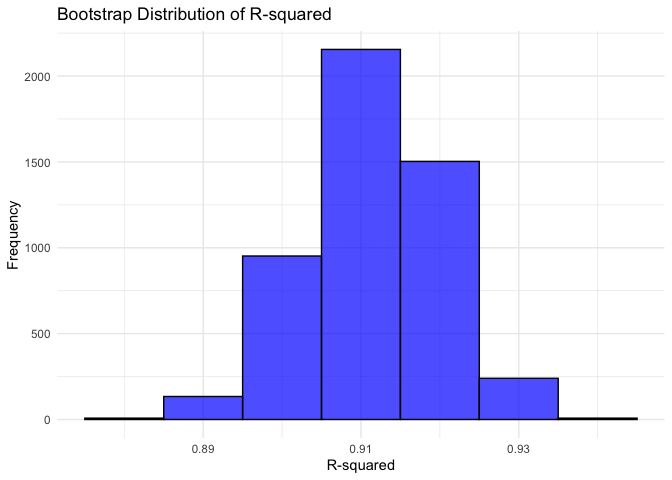
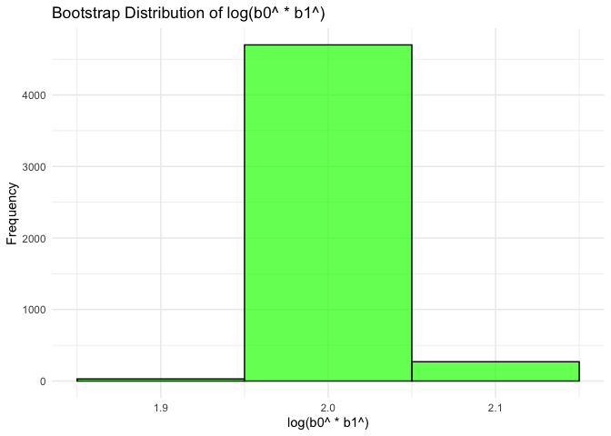
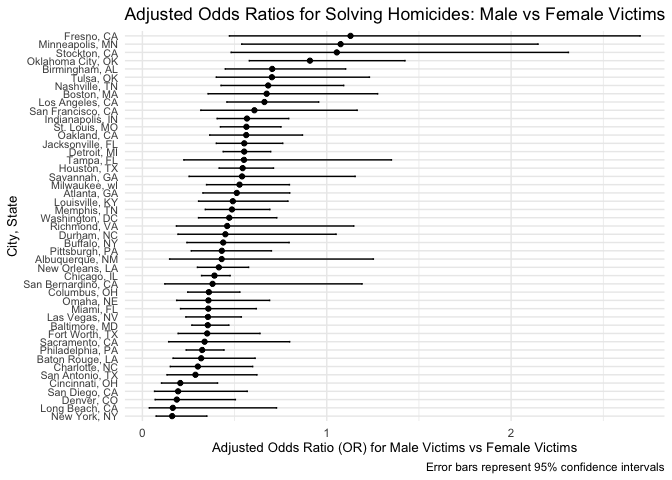

20241127_p8105_hw6
================
2024-11-28

## Problem 1

``` r
weather_df = 
  rnoaa::meteo_pull_monitors(
    c("USW00094728"),
    var = c("PRCP", "TMIN", "TMAX"), 
    date_min = "2017-01-01",
    date_max = "2017-12-31") %>%
  mutate(
    name = recode(id, USW00094728 = "CentralPark_NY"),
    tmin = tmin / 10,
    tmax = tmax / 10) %>%
  select(name, id, everything())
```

    ## using cached file: /Users/florapang/Library/Caches/org.R-project.R/R/rnoaa/noaa_ghcnd/USW00094728.dly

    ## date created (size, mb): 2024-09-26 10:19:28.845047 (8.651)

    ## file min/max dates: 1869-01-01 / 2024-09-30

Steps:

1.  Generate 5000 bootstrap samples

2.  Fit a linear regression model for each bootstrap sample where
    response is tmax and predictor is tmin

3.  For each bootstrap sample, calculate the R^2 and the logarithm of
    estimated coefficients multiplied

Boostrap function for 5000 samples

``` r
set.seed(123)

bootstrap_results = replicate(5000, {

sample_indices = sample(seq_len(nrow(weather_df)), replace = TRUE)
bootstrap_sample = weather_df[sample_indices, ]
  
  model = lm(tmax ~ tmin, data = bootstrap_sample)
  model_summary = summary(model)
  
  b0 = coef(model)[1]
  b1 = coef(model)[2]
  
  r_squared = model_summary$r.squared
  
  log_b0_b1 = log(b0 * b1)

  return(c(r_squared = r_squared, log_b0_b1 = log_b0_b1))
}, 

simplify = "matrix")

bootstrap_df = as.data.frame(t(bootstrap_results))
colnames(bootstrap_df) = c("R_squared", "log_b0_b1")
```

Plotting my results

``` r
ggplot(bootstrap_df, aes(x = R_squared)) +
  geom_histogram(binwidth = 0.01, fill = "blue", alpha = 0.7, color = "black") +
  labs(title = "Bootstrap Distribution of R-squared",
       x = "R-squared",
       y = "Frequency") +
  theme_minimal()
```

<!-- -->

The histogram plot for the R^2 values resulting from the 5000 bootstrap
shows a unimodal distribution, centered around the mean of the bootstrap
R^2 values. Additionally, the mean of the bootstrap R^2 values should be
very close to the R^2 value of the original weather dataframe that we
bootstrapped 5000 samples from. Most R^2 values lie within a range
indicating a good fit of the linear model. The variability is due to the
resampling process of bootstrapping.

``` r
ggplot(bootstrap_df, aes(x = log_b0_b1)) +
  geom_histogram(binwidth = 0.1, fill = "green", alpha = 0.7, color = "black") +
  labs(title = "Bootstrap Distribution of log(b0^ * b1^)",
       x = "log(b0^ * b1^)",
       y = "Frequency") +
  theme_minimal()
```

<!-- -->

This distribution is somewhat symmetric, where the mean or median of the
bootstrap distribution (2.0) shows a clear central eestimate of the log
product of b0^ and b1^. This means that the combined effect of these two
parameters has a central tendancy.

We can also learn that from the sign of b0^ and b1^ product being a
positive value that this helps to reinforce the idea of a positive
relationship between tmin and tmax

``` r
r_squared_ci = quantile(bootstrap_df$R_squared, c(0.025, 0.975))
print(paste("95% CI for R^2:", round(r_squared_ci[1], 4), "-", round(r_squared_ci[2], 4)))
```

    ## [1] "95% CI for R^2: 0.8946 - 0.9271"

``` r
log_b0_b1_ci = quantile(bootstrap_df$log_b0_b1, c(0.025, 0.975))
print(paste("95% CI for log(b0 * b1):", round(log_b0_b1_ci[1], 4), "-", round(log_b0_b1_ci[2], 4)))
```

    ## [1] "95% CI for log(b0 * b1): 1.9642 - 2.0584"

## Problem 2

``` r
homicide_df = 
  read_csv(file = "data/homicide-data.csv", na = c("NA", ",", ".")) %>% 
  janitor::clean_names() %>% 
  mutate(
    city_state = str_c(city, ", ", state),
    solved = ifelse(disposition %in% c("Closed without arrest", "Closed by arrest"), 1, 0),  
    victim_age = as.numeric(victim_age)  
  ) %>% 
  filter(
    victim_race %in% c("White", "Black"),  
    !is.na(victim_age),  
    !city_state %in% c('Dallas, TX', 'Phoenix, AZ', 'Kansas City, MO', 'Tulsa, AL')  
  )
```

    ## Warning: One or more parsing issues, call `problems()` on your data frame for details,
    ## e.g.:
    ##   dat <- vroom(...)
    ##   problems(dat)

    ## Rows: 52179 Columns: 12
    ## ── Column specification ────────────────────────────────────────────────────────
    ## Delimiter: ","
    ## chr (9): uid, victim_last, victim_first, victim_race, victim_age, victim_sex...
    ## dbl (3): reported_date, lat, lon
    ## 
    ## ℹ Use `spec()` to retrieve the full column specification for this data.
    ## ℹ Specify the column types or set `show_col_types = FALSE` to quiet this message.

    ## Warning: There was 1 warning in `mutate()`.
    ## ℹ In argument: `victim_age = as.numeric(victim_age)`.
    ## Caused by warning:
    ## ! NAs introduced by coercion

``` r
baltimore_data = homicide_df %>%
  filter(city_state == "Baltimore, MD")

baltimore_model = glm(solved ~ victim_age + victim_sex + victim_race, 
                       data = baltimore_data, 
                       family = binomial())

summary(baltimore_model)
```

    ## 
    ## Call:
    ## glm(formula = solved ~ victim_age + victim_sex + victim_race, 
    ##     family = binomial(), data = baltimore_data)
    ## 
    ## Coefficients:
    ##                   Estimate Std. Error z value Pr(>|z|)    
    ## (Intercept)       0.663792   0.174495   3.804 0.000142 ***
    ## victim_age       -0.005205   0.003255  -1.599 0.109790    
    ## victim_sexMale   -1.036564   0.142689  -7.264 3.74e-13 ***
    ## victim_raceWhite  0.899714   0.180304   4.990 6.04e-07 ***
    ## ---
    ## Signif. codes:  0 '***' 0.001 '**' 0.01 '*' 0.05 '.' 0.1 ' ' 1
    ## 
    ## (Dispersion parameter for binomial family taken to be 1)
    ## 
    ##     Null deviance: 3716.5  on 2752  degrees of freedom
    ## Residual deviance: 3619.5  on 2749  degrees of freedom
    ## AIC: 3627.5
    ## 
    ## Number of Fisher Scoring iterations: 4

Baltimore regression

``` r
tidy_baltimore_model = tidy(baltimore_model)
sex_coeff_bal = tidy_baltimore_model %>% 
  filter(term == "victim_sexMale")

odds_ratio_bal = exp(sex_coeff_bal$estimate)
lower_ci_sex_bal = exp(sex_coeff_bal$estimate - 1.96 * sex_coeff_bal$std.error)
upper_ci_sex_bal = exp(sex_coeff_bal$estimate + 1.96 * sex_coeff_bal$std.error)

cat("Adjusted Odds Ratio for solving homicides comparing male victims to female victims: ", odds_ratio_bal, "\n")
```

    ## Adjusted Odds Ratio for solving homicides comparing male victims to female victims:  0.3546711

``` r
cat("95% Confidence Interval: [", lower_ci_sex_bal, ", ", upper_ci_sex_bal, "]", "\n")
```

    ## 95% Confidence Interval: [ 0.268143 ,  0.4691213 ]

Regression for each city

``` r
city_state_df = homicide_df %>%
  group_by(city_state) %>%
  nest() %>%  
  mutate(
    
    model = map(data, ~ glm(solved ~ victim_age + victim_sex + victim_race, data = .x, family = "binomial")),  
    
    tidy_results = map(model, tidy)  
  ) %>%
  unnest(tidy_results) %>%
  filter(term == "victim_sexMale")  

city_state_df = 
  city_state_df %>%
  mutate(
    odds_ratio = exp(estimate),  
    lower_ci = exp(estimate - 1.96 * std.error),  
    upper_ci = exp(estimate + 1.96 * std.error)   
  ) %>%
  select(city_state, odds_ratio, lower_ci, upper_ci)  

print(city_state_df)
```

    ## # A tibble: 47 × 4
    ## # Groups:   city_state [47]
    ##    city_state      odds_ratio lower_ci upper_ci
    ##    <chr>                <dbl>    <dbl>    <dbl>
    ##  1 Albuquerque, NM      0.430    0.148    1.25 
    ##  2 Atlanta, GA          0.512    0.328    0.799
    ##  3 Baltimore, MD        0.355    0.268    0.469
    ##  4 Baton Rouge, LA      0.319    0.166    0.612
    ##  5 Birmingham, AL       0.704    0.450    1.10 
    ##  6 Boston, MA           0.674    0.356    1.28 
    ##  7 Buffalo, NY          0.438    0.241    0.796
    ##  8 Charlotte, NC        0.301    0.151    0.598
    ##  9 Chicago, IL          0.391    0.321    0.476
    ## 10 Cincinnati, OH       0.206    0.104    0.408
    ## # ℹ 37 more rows

``` r
ggplot(city_state_df, aes(x = reorder(city_state, odds_ratio), y = odds_ratio)) +
  geom_point() +  
  geom_errorbar(aes(ymin = lower_ci, ymax = upper_ci), width = 0.2) + 
  labs(
    x = "City, State", 
    y = "Adjusted Odds Ratio (OR) for Male Victims vs Female Victims", 
    title = "Adjusted Odds Ratios for Solving Homicides: Male vs Female Victims",
    caption = "Error bars represent 95% confidence intervals") +
  coord_flip() +
  theme_minimal()+ 
  theme(
    axis.text.y = element_text(size = 8), 
    axis.title = element_text(size = 10)
  )
```

<!-- -->

Those cities with odds ratio is greater than 1, means that male victims
are more likely to have their homicides solved compared to female
victims in that city, adjusting for age and race. Whereas, those cities
that have an odds ratio less than 1 suggests that male victims are less
likely to have their homicides solved compared to female victims.

Those cities that have overlapping confidence intervals would mean that
the difference in the odd ratios between these cities is not
statistically significant (at a 95% confidence). This could be important
to consider when assessing whether the observed differences in odd
ratios are truly meaningful or could be due to random variability across
the city states.

In cities liek New York, NY and Long Beach CA, the odds ratio have a
very low odds ratio, and as explained, that in these cities, homicides
involving male victims are significantly less likely to be solved than
those involving female victime. Furthermore, the confidence intervals
for these cities do not include 1 suggesting that the results is
statistically significant.

Other cities like Fresno, CA and Minneapolis, MN, show odds ratios very
close to 1. This indicates that there may not be any substantial
difference in the odds of solving homicides between male and female
victims. In these cities, the confidence intervals include 1, suggesting
no significant difference.
